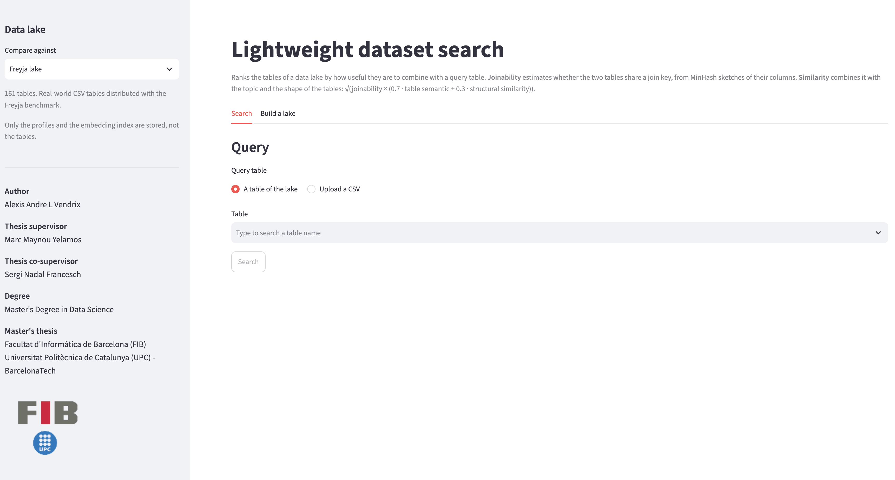
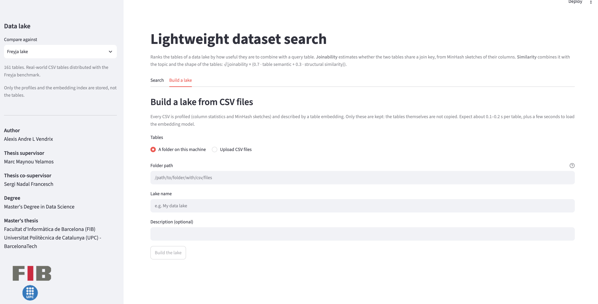
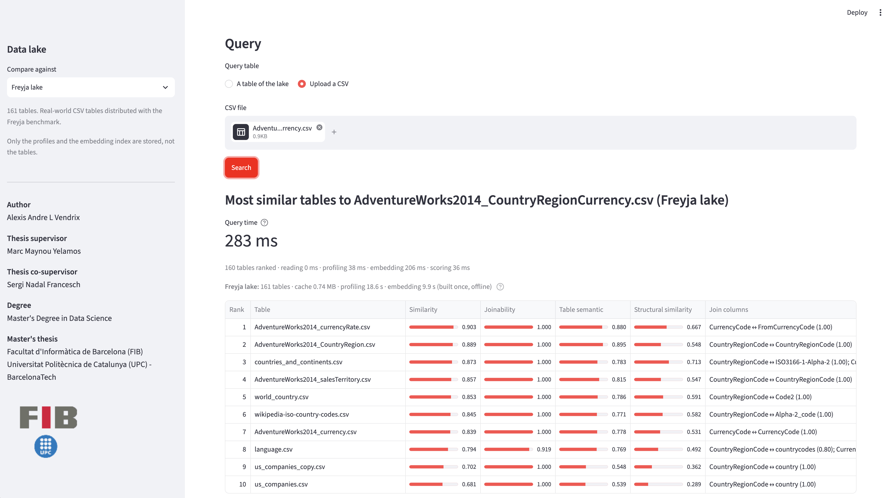

# Lightweight dataset search

A Streamlit demonstration of the **lightweight method** from the Master's thesis
_Lightweight Dataset Search_ (Master's Degree in Data Science, FIB, Universitat Politècnica de
Catalunya). Pick a data lake and a query table, and the app ranks every table of the lake by
how useful it is to combine with the query.

- **Query:** a table of the selected lake, or a CSV file you upload.
- **Result:** the 10 most similar tables, with their similarity, joinability and the column
  pairs that carry the join. Hover a column header for its definition.
- **Full ranking:** every table of the lake with all metrics, downloadable as CSV.
- **Build a lake** (second tab): point the app at a folder of CSV files, or upload them,
  and it builds a new lake (profiles, MinHash sketches, embeddings) that appears in the
  lake selector. The tables themselves are not copied. Expect about 0.1–0.2 s per table.



## Install and run

The app runs locally, on any machine with Python 3.10 or later (3.13 recommended). Copy the
whole folder (or clone the repository), then from inside it:

```bash
python -m venv .venv
source .venv/bin/activate            # Windows: .venv\Scripts\activate
pip install -r requirements.txt
streamlit run app.py                 # opens http://localhost:8501
```

The first install takes a few minutes, mostly for PyTorch. On Linux the CPU-only build is
installed, which avoids several GB of GPU libraries. To stop the app, press Ctrl+C in the
terminal; next time, only the last two commands are needed (activate, then run).

**The embedding model** (all-MiniLM-L6-v2, ~90 MB) is used only to encode an uploaded CSV and
to build a lake. If the folder has no `model/` subfolder, the model is downloaded from
Hugging Face the first time it is needed. To download it once and then work fully offline:

```bash
python download_model.py             # saves it to model/
```

Choosing a table of a shipped lake needs neither the model nor an internet connection.

## Building your own lake

In the **Build a lake** tab, give the path of a folder of CSV files (or upload the files) and a
name. The lake is saved in `lakes/<name>/` and stays there: it appears in the lake selector
every time the app starts. Only the profiles and embeddings are written; the CSV files are
neither copied nor modified. To remove a lake, delete its folder under `lakes/`. To share a
lake, copy its folder into the `lakes/` folder of another copy of the app.



## How it works



Every table of a lake was reduced offline to a compact **metaprofile**: a MinHash sketch of
every join-eligible column, a few column statistics, a table embedding and a structural
vector. A query is scored against every metaprofile; the tables themselves are never read
again.

| Column                | Meaning                                                                                                                                                                     |
| --------------------- | --------------------------------------------------------------------------------------------------------------------------------------------------------------------------- |
| Similarity            | sqrt(joinability x (0.7 x table semantic + 0.3 x structural similarity))                                                                                                    |
| Joinability           | can the two tables be joined? Per column pair: MinHash-estimated containment x compatibility prior (type and word length); aggregated by noisy-OR over the 3 strongest keys |
| Table semantic        | cosine of the two table embeddings (topic)                                                                                                                                  |
| Structural similarity | cosine of the role / cardinality / length histograms (shape)                                                                                                                |
| Join columns          | every join key as query column ↔ candidate column (pair joinability); the best weaker pair if there is none                                                                 |
| Join keys             | query columns whose best match scores at least 0.5                                                                                                                          |

Above the table, the app shows the query time and, for the selected lake, the number of
tables, the size of its cache and the time it took to build (profiling and embedding).

## Shipped lakes

**No table is stored.** A lake holds only hashes, counts, statistics and embeddings, so the
raw values cannot be read back from it. Table and column names are visible.

| Lake          | Tables | Cache  | Source                                                                                               |
| ------------- | ------ | ------ | ---------------------------------------------------------------------------------------------------- |
| Freyja lake   | 161    | 0.7 MB | the real-world tables of the Freyja benchmark                                                        |
| SANTOS subset | 493    | 2.0 MB | the 80 SANTOS benchmark query tables + 420 random tables of the SANTOS lake; 7 could not be profiled |

## Repository layout

```
app.py               the Streamlit page
download_model.py    optional: fetch the embedding model into model/
requirements.txt     pinned to the versions that built the lake indexes
engine/              the method: profiling (Freyja, DuckDB), MinHash sketches,
                     scoring, FAISS index, MiniLM encoder, and the lake builder
lakes/<lake>/        fingerprints.pkl (metaprofiles), semantic.index (FAISS),
                     semantic_mapping.pkl (index -> table name), lake.json (name,
                     description, table count, build times); one folder per lake
img/                 FIB / UPC logo and the screenshots of this README
```

The encoder versions in `requirements.txt` are those that built the lake indexes. Another
version encodes an uploaded file slightly differently, which moves similarity scores in the
second or third decimal.
